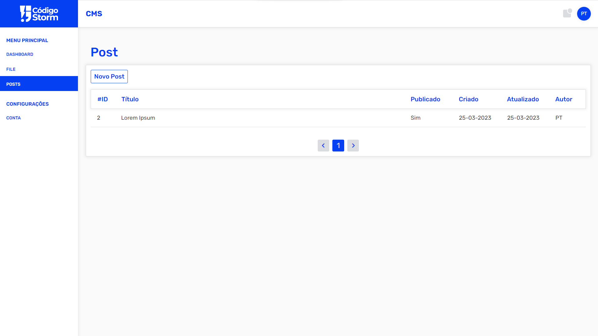

# CS CMS #

## Objetivo

CS CMS (dado nome CS como abreviação do projeto Código Storm) foi desenvolvido para o público que busca uma alternativa aos outros cms. Neste projeto foi implementado com as tecnologias descritas na composição do projeto.



### Composição do projeto

- Docker (engine)
- PHP
- Nginx
- Laravel
- MySQL
- PhpMyAdmin
- Vue Js

## Preparando os ambiente

### iniciantes em docker

Para quem ainda não tem conhecimento em docker recomendo buscar conhecimento na pagina oficial https://docs.docker.com/ antes de iniciar o desenvolvimento.

Para instalação do docker, recomendo utilizar docker engine para melhor desempenho durante o desenvolvimento. Escolha a distro Linux que mais atende sua necessidade, eu recomendo o ubuntu como uma boa escolha. Site oficial para instalação do docker engine https://docs.docker.com/engine/install/

### Criar diretório base de dados

Entre no diretório do projeto e rode o seguinte comando para criar os diretórios necessários.
```
mkdir database database/mysql
```

### Iniciando o Docker Engine

Iniciar serviço do docker engine
```
sudo service docker start
```

Criar e executar containers com base nas configurações definidas no arquivo docker-compose.yml, em segundo plano.
```
sudo docker-compose up -d
```

### Permissões
```
sudo chmod -R 777 src
```
O comando está concedendo permissões completas de leitura, escrita e execução para todos os usuários em todos os arquivos e pastas dentro do diretório "src" e seus subdiretórios. O laravel precisará que isto seja executado para poder operar corretamente.

### Migrando base de dados
```
sudo docker-compose exec php php artisan migrate --seed
```

### Portas

| Serviço  | Porta |
| --- | --- |
| PHP  | 9000 |
| Nginx  | 3000 |
| MySQL | 3306 |
| PhpMyAdmin | 3400 |
| Vue JS | 5000 |

## Sobre o Projeto

Desenvolvedor: [Paulo Teixeira](https://github.com/paulo-teixeira-developer)

Versão: Alfa


